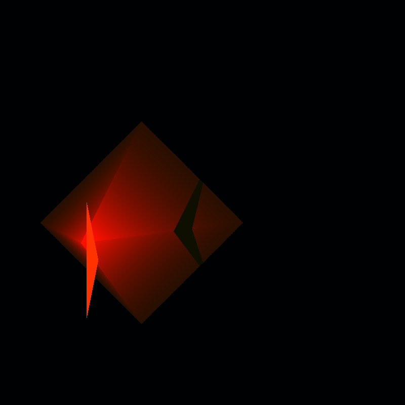

# xml-raytracer

Multithreaded, experimental, C++ recursive raytracer that can render complex meshes with lighting, reflection and shadow support. Renderer supports shading with _ambient_, _diffuse_, _specular_, _phong_ and _reflective_ materials. Example scenes are created with blender 3d.

It reads scene data from xml files and renders the resulting frame as a PPM image file.

## Build

Build uses VCPKG to manage dependencies.

```bash
mkdir build
cd build
cmake ..
cmake -build .
```

## Usage

Program takes the scene file in xml format as a cli argument. You can place lights, objects (meshes) with different materials into the scene. You can also configure your camera setup in the xml file. Check the provided example scenes for more info on the format of xml scene files.

```
./xml-raytracer [path-to-xml-scene-file]
```

## Results





